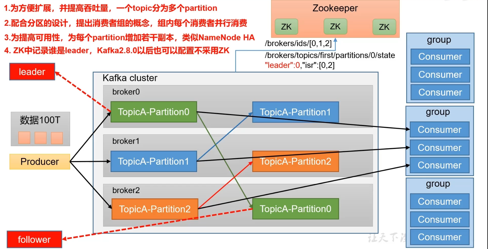
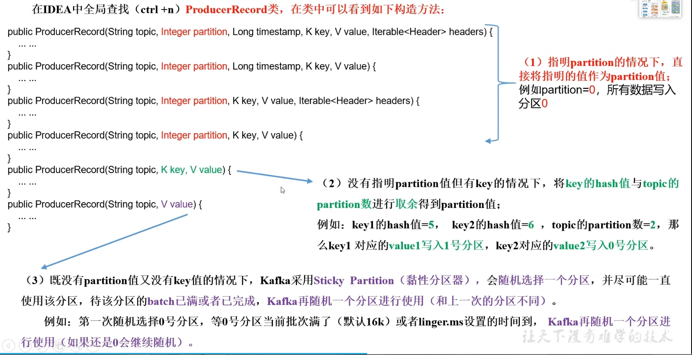
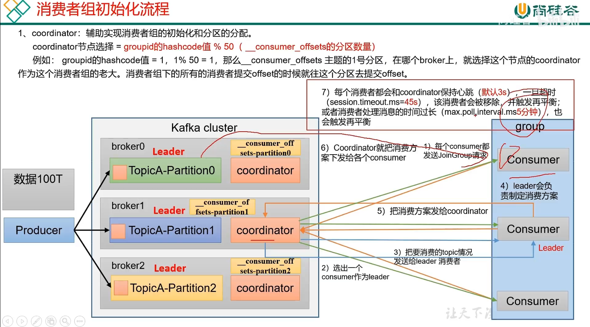

# 基础篇

# 一、概述

## 1.定义

**kafka传统定义**：kafka是一个分布式的基于发布/订阅模式的消息队列（Message Queue），主要应用于大数据实时处理领域。

发布/订阅：消息的发布者不会将消息直接发送给特定的订阅者，而是将发布的消息分为不同的类别，订阅者只接收感兴趣的消息。

**kafka最新定义**：kafka是一个开源的分布式事件==流平台==（Event Streaming Platform），被数千家公司用于高性能数据管道、流分析、数据集成和关键人物应用。（==存储、计算==）


## 2.应用场景

缓冲/消峰：有助于控制和优化数据流经过系统的速度，解决生产消息和消费消息的处理速度不一致的情况。（双11秒杀场景）

解耦：允许你独立的扩展或修改两边的处理过程，只要确保他们遵守同样的接口约束。（数据源跟目的地解耦）

异步通信：允许用户把一个消息放入队列，但并不立即处理它，然后在需要的时候再去处理它们。

## 3.消息队列的两种模式


1、点对点

​	（1）一个生产者、一个消费者  一个topic	会删除数据	不多

2、发布订阅

​	（1）多个生产者	多个消费者	而且相互独立	多个topic	不会删除数据

## 4.基础架构

1、为方便扩展，并提高吞吐量，一个topic分为多个partition

2、配合分区的设计，提出消费者组的概念，组内每个消费者并行消费（一个partition中的数据只能一个consumer消费）

3、为提高可用性，为每个partition增加若干副本，类似NameNode HA

4、ZK中记录谁是leader，kafka2.8.0以后也可以配置不采用ZK



zookeeper作用

记录服务器节点运行状态，记录每个分区谁是leader


架构

1）生产者

​		100T数据

2）broker

​		（1）broker服务器hadoop102 103 104

​		（2）topic 主题   对数据分类

​		（3）分区

​		（4）可靠性   副本

​		（5）leader   follower

​		（6）生产者和消费者  只针对leader操作

3）消费者

​		（1）消费者和消费者相互独立

​		（2）消费者组（某个分区   只能由一个消费者消费）

4）zookeeper

​		（1）broker.ids   0 1 2

​		（2）leader

# 二、入门

## 5.kafka安装

broker用scala语言开发，C/S端用java开发

先进入config目录配置server.properties

```pro
broker.id=0

log.dirs=/opt/module/kafka/datas

zookeeper.connect=hadoop102:2181,hadoop103:2181,kadoop104:2181/kafka
```

退到kafka安装目录，执行如下命令，(对kafka进行一个分发)

```bash
xsync kafka/
```

完成后再修改其他两台机器的配置（broker.id=1，2）

然后配置环境变量

```bash
vim /etc/profile.d/my_env.sh

#KAFKA_HOME
export KAFKA_HOME=/opt/module/kafka
export PATH=$PATH:$KAFKA_HOME/bin

source /etc/profile

##执行分发
sudo /home/atguigu/bin/xsync /etc/profle.d/my_env.sh


#分发完需要重新执行下环境变量
#然后启动zookeeper集群
xcall jps

#启动kafka
bin/kafka-server-start.sh -daemon config/server.properties
```

## 启动停止脚本

在用户目录下的bin目录下，新建kf.sh文件：

```bash
#!/bin/bash

case $1 in
"start")
    for i in hadoop102 hadoop103 hadoop104
    do
    	echo "--- 启动 $i kafka ------"
        ssh $i "/opt/module/kafka/bin/kafka-server-start.sh -daemon /opt/module/kafka/config/server.properties"
    done
;;
"stop")
	for i in hadoop102 hadoop103 hadoop104
    do
    	echo "--- 停止 $i kafka ------"
        ssh $i "/opt/module/kafka/bin/kafka-server-stop.sh"
    done
;;
esac
```


安装：

1）broker.id   必须全局唯一

2）broker.id、log.dirs    zk/kafka

3）启动停止  先停止kafka   再停zk

4）脚本（见上面）

## 常用操作

1、查看操作主题命令参数

```bash
bin/kafka-topics.sh
```

| 参数                                             | 描述                                 |
| ------------------------------------------------ | ------------------------------------ |
| --bootstrap-server<String:server toconnect to>   | 连接的kafka Broker主机名称和端口号。 |
| --topic < String:topic >                         | 操作的topic名称                      |
| --create                                         | 创建主题                             |
| --delete                                         | 删除主题                             |
| --alter                                          | 修改主题                             |
| --list                                           | 查看所有主题                         |
| --describe                                       | 查看主题详细描述                     |
| --partitions <Integer:replication factor>        | 设置分区数                           |
| --replication-factor<Integer:replication factor> | 设置分区副本                         |
| --config< String:name=value >                    | 更新系统默认的配置                   |

```bash
#创建主题  一个分区，三个副本
bin/kafka-topics.sh --bootstrap-server hadoop102:9092 --topic first --create --partitions 1 --replication-factor 3

#查看
bin/kafka-topics.sh --bootstrap-server hadoop102:9092 --list

#查看详细信息
bin/kafka-topics.sh --bootstrap-server hadoop102:9092 --topic first --describe

#修改分区数（只能增加，不能减少）
bin/kafka-topics.sh --bootstrap-server hadoop102:9092 --topic first --alter --partitions 3
```

2、服务端操作

```bash
bin/kafka-console-producer.sh --bootstrap-server hadoop102:9092 --topic first
>hello
```

消费端操作(只能消费到consumer启动后生产的数据)

```bash
bin/kafka-console-consumer.sh --bootstrap-server hadoop102:9092 --topic first
```

要想消费消费者启动前生产的数据，需要加--from-beginning参数

```bash
bin/kafka-console-consumer.sh --bootstrap-server hadoop102:9092 --topic first --from-beginning
```

常用命令行

1）主题 kafka-topic.sh

​	（1）--bootstrap-server hadoop102:9092,hadoop103:9092

​	（2）--topic first

​	（3）--create

​	（4）--delete

​	（5）--alter

​	（6）--list

​	（7）--describe

​	（8）--partitions

​	（9）--replication-factor

2）生产者 kafka-console-producer.sh

​	（1）--bootstrap-server hadoop102:9092,hadoop103:9092

​	（2）--topic first

3）消费者kafka-console-consumer.sh

​	（1）--bootstrap-server hadoop102:9092,hadoop103:9092

​	（2）--topic first

# 三、生产者

## 6.生产者原理

用自己的序列化器，不用java的是因为java的序列化传输数据太重，除了有效数据外，还有安全验证信息。kafka为了高效，只传有效数据。

双端队列     内存池

**发送流程**


失败重试次数是int的最大值。可以设置

一个分区创建一个队列（partitioner分区器中的内存创建）。方便数据的管理。内存中创建多个队列，总大小为32M。一批次大小为16k

发送到服务端：以每个节点broker为key，后面跟上请求，会把相同的分区请求放到一个队列里面（sender请求里的线程），发送给服务端相应的分区中。

sender线程中的队列中最多可以缓存5个请求。


发送过程：

main线程中创建producer对象，执行send方法（两种，一个producerRecord，另一种带回调的）。发送的过程中有可能会遇到拦截器interceptor，通过序列化器serializer对数据进行序列化，通过分区器来规定每个数据发送到哪个分区。其实是发送到一个缓存队列（==双端队列，还有个内存池==（往缓存队列中发送批次数据的时候，需要到内存池拿内存，完了把内存还给内存池））中（32M，每批次大小是16K），sender（拉取）线程帮我们把队列中的数据发送到kafka服务器（满足两个条件之一，批次大小或者linger.ms），会做缓存，每个缓存中最多放5个批次数据。底层链路上调用的是selector。链路打通就可以把队列中的数据发送到kafka服务器，并对数据进行副本备份，完毕后服务端会给生产者发送应答。leader和所有的isr节点都受到后进行应答。如果正常收到，先清请求，再删队列中的数据，如果收到异常，会失败重试。

## 7、异步发送

外部数据发送到队列中，达到linger.ms或者batch.size时就发送给kafka集群

0）配置

​	（1）连接 bootstrap-server

​	（2）key value序列化

1）创建生产者

kafkaProducer<String,String>()

2）发送数据

​	send()   send(,new Callback)

3）关闭资源


同步发送

send()   send(,new Callback).get()

## 8、kafka分区好处

1、便于合理使用存储资源，每个partition在一个broker上存储，可以把海量的数据按照分区切割成一块一块数据存储在多台broker上。合理控制分区的任务，可以实现==负载均衡==的效果。（分区可以把海量数据存储在多台服务器上，任意切割）

2、提高并行度，生产者可以以分区为单位发送数据，消费者可以以分区为单位进行消费数据。（提高生产者往集群发送的并行度，同时增加了消费者消费集群数据的并行度。）


好处：存储、计算

## 9、分区策略



分区规则：

（1）指定分区  按分区走

（2）key  key的hashcode值%分区数

（3）没有指定key   没有指定分区  粘性      

第一随机（跟上一次不相同）

## 10、自定义分区

定义类  实现partitioner接口

## 11、生产者如何提高吞吐量

batch.size：批次大小，默认16k    				32K

linger.ms：等待时间，修改为5-100ms（延迟）


compression.type：压缩snappy


RecordAccumulator：缓冲区大小，默认32M ，修改为64m


## 12、数据可靠性


ack=-1可以保证消息可靠性，但效率低，可能会出现重复数据。


acks

0  丢失数据

1   也可能会丢  传输普通日志

-1    完全可靠  + 副本大于等于2，isr 最小副本数  >=2    （数据重复）

## 13、数据重复（事物）


判断重复数据标准：

具有<PID，Partition，SeqNumber>相同主键的消息提交时，Broker只会持久化一条。其中PID是kafka每次重启都会分配一个新的；partition表示分区号；Sequence Number是单调自增的。

所以幂等性==只能保证是在单分区单会话内不重复==

如何使用幂等性

开启参数enable.idempotence默认为true，false关闭。


数据重复

1）幂等性   

​			<pid,分区号，序列号>  

​			默认打开

2）事物

​			底层基于幂等性

​		（1）初始化

​		（2）启动

​		（3）消费者offset

​		（4）提交

​		（5）终止


事物协调器

分区副本leader

存储事物主题（默认50个分区）存储事物相关信息

事物id的hash值跟50取余，得到对应的分区。该分区节点上的事物协调器就是本次事物的负责人。


生产者会跟事物协调器申请事物id，等获取到事物id后会，发送数据，提交commit请求，tc会把事物持久化到topic中，只要提交成功，就会给生产者反馈已经持久化成功。事物协调器找分区副本leader校验是否真正把数据处理好了，得到确认后，事物协调器跟主题确认本次事物结束。


## 14、数据有序

单分区内有序，或者消费者自己重排序

多分区有序怎么办？（消费端自己重排序）

## 15、数据乱序

在生产端（有几个broker节点，就开几个缓存队列），每个broker里面最多只能存5个request，当发送1234时，3失败了，进行重试，这时候consumer端消费的顺序就成了124了，3就排后面去了。

解决办法：

1）kafka在1.x版本之前保证数据单分区有序，条件如下：

max.in.flight.requests.per.connection=1(不需要考虑是否开启幂等性)

2）kafka在1.x及以后版本保证数据单分区有序，条件如下：

（1）未开启幂等性

max.in.flight.requests.per.connection需要设置为1.

（2）开启幂等性

max.in.flight.requests.per.connection需要设置小于等于5

原因说明：因为在kafka1.x以后，启用幂等后，kafka服务端会缓存producer发来的最近5个request的元数据，故无论如何，都可以保证最近5个request的数据都是有序的。


乱序

1）inflight = 1

2）没有幂等性 inflight = 1

3）有幂等性


# 四、kafka_broker


zk存储了哪些信息

（1）broker.ids

（2）leader

（3）辅助选举  controller

## 16、kafka broker总体工作流程


zk中存储：broker_ids,controller

每上线一个broker，会在zk中注册一下，broker中的controller谁抢到zk中的controller，抢到后会第一时间监控zk中ids节点的变化。同时会选择从isr队列里活着的，并且排在ar队列中前面的，选举为leader。并且会把leader信息记录在zk中。

follower会主动拉取leader中的数据，完了会持久化到硬盘。以log形式存储，log下是segment，每个segment大小是1G（底层创建了索引）

leader挂了后，ids就会监听到他的变化。broker中的controller监听到会从zk中的leader拿取最新信息，拉取过来后会在isr队列中选择活着的，并且在ar中排前面的节点成为新的leader。

## 17、节点的服役和退役

集群唯一标识

修改server.properties下的broker.id=3，然后启动新加的节点

新节点没有同步老节点的topic数据


服役

1）准备一台干净服务器 hadoop100

2）对哪个主题操作

3）形成计划

4）执行计划

5）验证计划


1、执行负载均衡操作：在kafka目录下

vi topics-to-move.json（创建一个要负载均衡的主题）

```json
{
    "topics": [
        {"topic"：“first”}
    ],
    "version":1
}
```

2、执行如下命令生成一个负载均衡计划

```bash
$ bin/kafka-reassign-partitions.sh --bootstrap-server hadoop102:9092 --topics-to-move-json-file topics-to-move.json --broker-list "0,1,2,3" --generate
```

3、如果觉得上面的负载计划还可以，就再创建一个json文件

（创建副本存储计划（所在副本存储在broker0、broker1、broker2、broker3中））。

```bash
$ vim increase-replication-factor.json
```

将上面的Proposed partition reassignment configuration下面的内容复制粘贴到新创建的文件内。

4、执行副本存储计划

```bash
$ bin/kafka-reassign-partitions.sh --bootstrap-server hadoop102:9092 --reassignment-json-file increase-replication-factor.json --execute
```

5、验证副本存储计划

```bash
$ bin/kafka-reassign-partitions.sh --bootstrap-server hadoop102:9092 --reassignment-json-file increase-replication-factor.json --verify
```

### 退役旧节点

退役

1）要退役的节点不让存储数据

2）退出节点


1、创建一个要均衡的主题（在kafka目录下）

$ vim topics-to-move.json

```json
{
    "topics": [
        {"topic": "first"}
    ],
    "version": 1
}
```

2、创建执行计划

```bash
$ bin/kafka-reassign-partitions.sh --bootstrap-server hadoop102:9092 --topics-to-move-json-file topics-to-move.json --broker-list "0,1,2" --generate
```

3、重复上面的步骤3、4、5

如果想手动看下，可以使用如下命令

```bash
$ bin/kafka-topics.sh --bootstrap-server hadoop102:9092 --topic first --describe

#停掉105
$ bin/kafka-server-stop.sh

$jps
```

## 18、kafka副本

作用：提高数据可靠性

默认副本是一个，一般配置2个。

kafka中副本为：leader和follower。生产者只会把数据发往leader。follower找leader同步。

kafka分区中的所有副本统称为AR（Assigned Repllicas）。

AR = ISR + OSR

ISR：表示和leader保持同步的follower集合。阈值由replica.lag.time.max.ms参数设定。默认30秒。leader故障后，会从ISR中选举新的leader.

OSR：表示follower与leader副本同步时，延迟过多的副本。

## 19、Leader选举流程


leader选举按照replicas的顺序来选举。（按AR的顺序来进行排序）

```bash
#创建一个 4个分区4个副本的kafka主题
$ bin/kafka-topics.sh --bootstrap-server hadoop102:9092 --create --topic atguigu2 --partitions 4 --replication-factor 4

#查看创建的主题
$ bin/kafka-topics.sh --bootstrap-server hadoop102:9092 --describe --topic atguigu2

#停止节点
$ bin/kafka-server-stop.sh
$ jps

#恢复节点
$ bin/kafka-server-start.sh -daemon config/server.properties
```

## 20、Follower故障


## 21、leader故障处理


只保证副本之间数据的一致性

## 22、分区副本分配

16个分区  ，3个副本

```bash
#创建一个16个分区，3个副本的名为second的主题
$ bin/kafka-topics.sh --bootstrap-server hadoop102:9092 --create --topic second --partitions 16 --replication-factor 3

#查看主题信息
$ bin/kafka-topics.sh --bootstrap-server hadoop102:9092 --describe --topic second
```


为了均匀分布，同时保证数据可靠（负载均衡）

## 23、生产经验-手动调整分区副本

```bash
#创建4个分区，2个副本的主题
$ bin/kafka-topics.sh --bootstrap-server hadoop102:9092 --create --topic three --partitions 4 --replication-factor 2

$ bin/kafka-topics.sh --bootstrap-server hadoop102:9092 --describe --topic three

#创建副本存储计划（所有副本都制定存储在broker0、broker1中）（在kafka目录下）
$ vim increase-replication-factor.json
#内容如下：
{
    "version":1,
    "partitions":[{"topic":"three","partition":0,"replicas":[0,1]},
                  {"topic":"three","partition":1,"replicas":[0,1]},
                  {"topic":"three","partition":2,"replicas":[1,0]},
                  {"topic":"three","partition":3,"replicas":[1,0]}]
}

#执行副本存储计划
$ bin/kafka-reassign-partitions.sh --bootstrap-server hadoop102:9092 --reassignment-json-file increase-replication-factor.json --execute

#验证副本存储计划
$ bin/kafka-reassign-partitions.sh --bootstrap-server hadoop102:9092 --reassignment-json-file increase-replication-factor.json --verify

$ bin/kafka-topics.sh --bootstrap-server hadoop102:9092 --describe --topic three
```

## 24、Leader Partition负载平衡


生产环境不建议把auto.leader.rebalance.enable设置为true，因为频繁的自动平衡会影响kafka的性能。（需要把leader均匀分布完，才能生产和消费相关操作），如果非要设置为true，则可以适当的把10%调大点。

原则就是不要频繁触发平衡相关操作。浪费集群大量性能。

## 25、生产经验-增加副本因子

```bash
#创建一个主题
$ bin/kafka-topics.sh --bootstrap-server hadoop102:9092 --create --topic four --partitions 3 --replication-factor 1

#手动增加副本存储
$ vim increase-replication-factor.json

{
    "version":1,
    "partitions":[{"topic":"four","partition":0,"replicas":[0,1,2]},
                 {"topic":"four","partition":1,"replicas":[0,1,2]},
                 {"topic":"four","partition":2,"replicas":[0,1,2]}]
}

#执行副本存储计划
$ bin/kafka-reassign-partitions.sh --bootstrap-server hadoop102:9092 --reassignment-json-file increase-replication-factor.json --execute
```

## 26、文件存储机制


通过工具查看index和log信息（在datas/first-0目录下）

```bash
$ kafka-run-class.sh kafka.tools.DumpLogSegments --files ./00000000000000000.index
```


日志索引按照稀疏索引，log日志每存储4kb文件，会往index文件写入一条索引日志。

## 27、kafka文件清除策略

kafka中默认的日志保存时间为7天，可以通过调整如下参数修改保存时间。

- log.retention.hours，最低优先级小时，默认7天
- log.retention.minutes，分钟
- log.retention.ms，最高优先级毫秒
- log.retention.check.interval.ms，负责设置检查周期，默认5分钟。


kafka中提供的日志清理策略有==delete==和==compact==两种

1、delete日志删除：将过期数据删除

​	log.cleanup.policy=delete 所有数据启用删除策略

​	（1）基于时间：默认打开。以segment中所有记录中的最大时间戳作为该文件时间戳

​	（2）基于大小：默认关闭。超过设置的所有日志总大小，删除最早的segment。

​			log.retention.bytes，默认等于-1，表示无穷大。

2、compact日志压缩


## 28、高效读写

1、kafka本身是分布式集群，可以采用分区技术，并行度高

2、读数据采用稀疏索引，可以快速定位要消费的数据

3、顺序写磁盘

4、页缓存+零拷贝技术


# 五、kafka消费者

## 29、kafka消费方式

- pull（拉）模式
  - consumer采用从broker中主动拉取数据。**kafka采用这种方式**。
- push（推）模式：
  - kafka没有采用这种方式，因为由broker决定消息发送速率，很难适应所有消费者的消费速率。


pull模式不足之处是，如果kafka没有数据，消费者可能会陷入循环中，一直返回空数据。

## 30、kafka消费者工作流程


0.9版本之前的offset会保存在zookeeper中，因为consumer都保存在zookeeper上，会导致大量的consumer跟zookeeper之间频繁的交互操作，导致网络上数据传输非常频繁。

## 31、消费者组工作原理

Consumer Group（CG）：消费者组，由多个consumer组成。形成一个消费者组的条件，是所有消费者的groupid相同。

- 消费者组内每个消费者负责消费不同分区的数据，一个分区只能由一个组内消费者消费。
- 消费者组织间互不影响。所有的消费者都属于某个消费者组，即消费者组是逻辑上的一个订阅者。
- 如果向消费组中添加更多的消费者，超过主题分区数量，则有一部分消费者就会闲置，不会接收任何消息。
- 消费者组之间互不影响。所有的消费者都属于某个消费者组，即消费者组是逻辑上的一个订阅者。

## 32、消费者组初始化流程



两个条件触发再平衡

1、消费者和coordinator通信时间超过45s

2、消费者处理消息超过5分钟

## 33、消费者组详细消费流程


## 34、消费者API

消费一个主题

```bash
#向first主题中发送数据
$ bin/kafka-console-producer.sh --bootstrap-server hadoop102:9092 --topic first
>hello
>
```

消费一个分区

消费者组案例

## 35、生产经验---分区的分配以及再平衡


### 第一种：Range


说明：Kafka 默认的分区分配策略就是 Range + CooperativeSticky，所以不需要修改策略。


如果有某个节点挂了后，在45s内，会把挂了的节点任务整个分配到其他存活的某一台节点上。

等下次任务来时，消费节点会重分配。0，1，2，3       4，5，6

### 第二种：RoundRobin


```java
// 修改分区分配策略
properties.put(ConsumerConfig.PARTITION_ASSIGNMENT_STRATEGY_CONFIG,"org.apache.kafka.clients.consumer.RoundRobinAssignor");

//Sticky：org.apache.kafka.clients.consumer.StickyAssignor
```

如果某个节点挂了，会把节点任务轮询分配到剩余的存活节点。

下次任务来时，重新轮询分配任务到消费节点。0，2，4，6        1，3，5

### 第三种：Sticky以及再平衡

consumer端每次消费的partition节点都不同。

跟range区别是，尽量均匀又随机的分配


当某个节点挂了后，会尽量均匀的将节点任务分配给剩余存活节点进行消费。

下次任务来时，会重新均匀分配任务到消费节点。1，0，4，6						2，3，5

## 36、offset保存位置

52