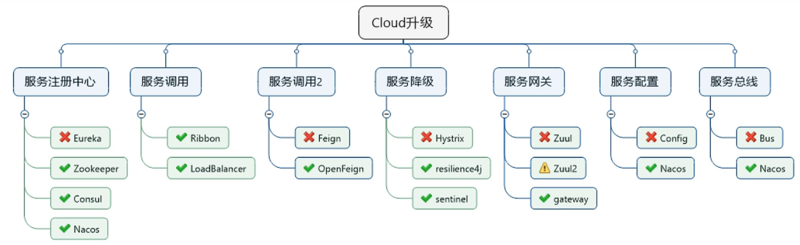
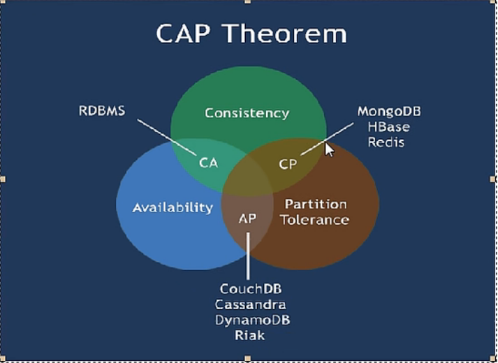
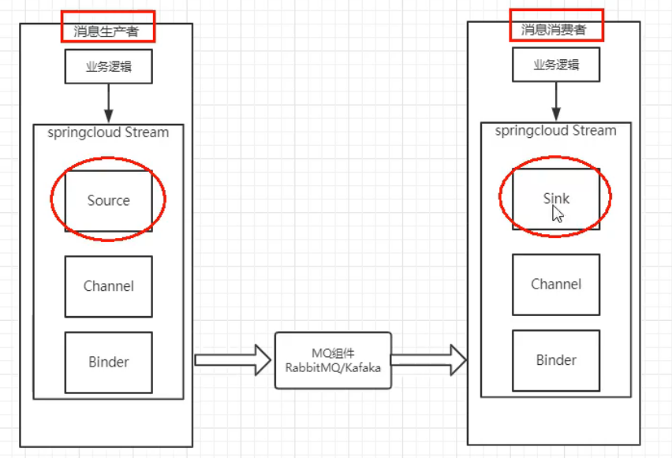

# 自动部署

自动部署ctrl+alt+shift+/
registry

compiler.automake.allow.when.app.running

actionSystem.assertFocusAccessFromEdt


Cloud升级



# Eureka 注册中心

## Eureka集群原理

服务注册：将服务信息注册进注册中心

服务发现：从注册中心上获取服务信息

实质：存key服务名   取value调用地址


注册自身信息：包括服务地址以别名方式注册进eureka

消费者在需要调用接口时，使用服务别名去注册中心获取实际的RPC远程调用地址

消费者获得调用地址后，底层实际利用HttpClient技术实现远程调用

消费者获得服务地址后会缓存在本地jvm内存中，默认每间隔30秒更新一次服务调用地址


原理：==互相注册，相互守望==，对外暴露出一个整体


集群配置，需要改hosts文件：

127.0.0.1 eureka7001.com

127.0.0.1 eureka7002.com

==AP原则==

//查看微服务健康状态

http://localhost:8001/actuator/health

eureka自我保护机制：某时刻某一个微服务不可用了，Eureka不会立刻清理，依旧会对该微服务的信息进行保存，属于CAP里面的AP分支。

如果EurekaServer在一定时间内没有接收到某个微服务实例的心跳，EurekaServer将会注销该实例（默认90秒）。

通俗讲就是==好死不如赖活着==

## 禁止Eureka自我保护机制

```yml
//服务端
eureka:
  server:
    # 关闭自我保护机制，保证不可用服务被及时剔除
    enable-self-preservation: false
    eviction-interval-timer-in-ms: 2000
    
    
//客户端
#Eureka客户端向服务端发送心跳的时间间隔，单位为秒（默认是30秒）
eureka:
  instance:
    lease-renewal-interval-in-seconds: 1
    #Eureka服务端在收到最后一次心跳后等待时间上限，单位为秒（默认是90秒），超时将剔除服务
    lease-expiration-duration-in-seconds: 2
```

# zookeeper

==CP原则==

在bin目录下,执行如下命令启动客户端

```cmd
./zkCli.sh

//查看节点
ls /

//获取节点信息
get /zookeeper

ls /zookeeper

ls /services

ls /services/cloud-provider-payment

ls /services/cloud-provider-payment/b0d864b5-3d49-4094-8f04-8c5fe63e5834

get /services/cloud-provider-payment/b0d864b5-3d49-4094-8f04-8c5fe63e5834
```

微服务注册到zookeeper的节点是==临时节点==

zookeeper节点分为临时节点和持久节点（带序号的临时/持久节点）

# Consul

是一套开源的分布式服务发现和配置管理系统。Go语言开发

提供了微服务系统中的服务治理、配置中心、控制总线等功能。完整的服务网格解决方案。

优点：基于raft协议，比较简洁；支持健康检查，同时支持HTTP和DNS协议 支持跨数据中心的WAN集群，跨平台，提供图形界面。

## 能干的事情

服务发现：提供HTTP和DNS两种发现方式

健康监测：支持多种方式，HTTP、TCP、Docker、Shell脚本定制化

KV存储：Key、Value的存储方式

多数据中心：Consul支持多数据中心

可视化Web界面


consul --version

consul agent -dev

# 三个注册中心异同点

| 组件名    | 语言 | CAP  | 服务健康检查 | 对外暴露接口 | Spring Cloud集成 |
| --------- | ---- | ---- | ------------ | ------------ | ---------------- |
| Eureka    | Java | AP   | 可配支持     | HTTP         | 已集成           |
| Consul    | Go   | CP   | 支持         | HTTP/DNS     | 已集成           |
| Zookeeper | Java | CP   | 支持         | 客户端       | 已集成           |



## CAP：

C：Consistency（强一致性）

A：Availability（可用性）

P：Partition tolerance（分区容错性）

CAP理论关注粒度是数据，而不是整体系统设计的策略


先保证网站不垮，不瘫，可用，后期再通过base理论，柔性事物补充进行数据的恢复和整体的一致性 


CP：出现网络分区后，同步失败会返回错误信息（为了保证一致性，必须拒绝请求）

AP：出现网络分区后，同步失败会返回同步前的数据


# Ribbon 负载均衡

客户端的软件负载均衡算法和服务调用

集中式LB（服务端）

即在服务的消费方和提供方之间使用独立的LB设施（可以是硬件，如F5，也可以是软件，如nginx），由该设施负责把访问请求通过某种策略转发至服务的提供方。


进程内LB（本地）

将LB逻辑集成到消费方，消费方从服务注册中心获知有哪些地址可用，然后自己再从这些地址中选择出一个合适的服务器。

Ribbon就属于进程内LB，它只是一个类库，集成于消费方进程，消费方通过它来获取到服务提供方的地址。


### Ribbon本地负载均衡客户端VS Nginx服务端负载均衡区别

Nginx是服务器负载均衡，客户端所有请求都会交给nginx,然后由nginx实现转发请求，即负载均衡是由服务端实现的


Ribbon本地负载均衡，在调用微服务接口时候，会在注册中心上获取注册信息服务列表之后缓存到JVM本地，从而在本地实现RPC远程服务调用技术。


Ribbon：就是负载均衡+RestTemplate调用


IRule算法：

AbstractLoadBalancerRule（抽象类）

具体实现：

RoundRobinRule：轮询

​     ----->WeightedResponseTimeRule：对RoundRobinRule的扩展，响应速度越快的实例选择权重越大，越容易被选择。

RandomRule：随机

RetryRule：先按照RoundRobinRUle策略获取服务，如果获取服务失败则在指定时间内会进行重试，获取可用的服务。

BestAvailableRule：会先过滤掉由于多次访问故障而处于断路器跳闸状态的服务，然后选择一个并发量最小的服务

AvailabilityFilteringRule：先过滤掉故障实例，再选择并发较小的实例

ZoneAvoidanceRule：默认规则，复合判断server所在区域的性能和server的可用性选择服务器

## Ribbon轮询算法原理

负载均衡算法：rest接口第几次请求数 % 服务器集群总数量 = 实际调用服务器位置下标，每次服务重启动后rest接口计数从1开始。

源码：自旋锁+CAS

# OpenFeign 服务接口调用

Feign是一个声明式的Web服务客户端，让编写Web服务客户端变得非常容易，只需要创建一个接口并在接口上添加注解即可。


旨在使编写Java Http客户端变得更容易

只需要创建一个接口并使用注解的方式来配置它，即可完成对服务提供方的接口绑定，简化了使用Spring Cloud Ribbon时，自动封装服务调用客户端的开发量。


OpenFeign日志级别：

NONE：默认的，不显示任何日志

BASIC：仅记录请求方式、URL、响应状态码及执行时间

HEADERS：除了BASIC中定义的信息之外，还有请求和响应的头信息；

FULL：除了HEADERS中定义的信息之外，还有请求和响应的正文及元数据。

# Hystrix 服务熔断

==服务降级、服务熔断==、服务隔离、服务限流   ==接近实时的监控==


服务降级、服务断路用在自己项目中。

高内聚、低耦合

网络卡顿、调用超时、程序出错、机房断电

机房着火、大楼断电、服务卡顿、网络拥堵


Hystrix是一个用于处理分布式系统的==延迟==和==容错==的开源库。能够保证在一个依赖出问题的情况下，不会导致整体服务失败，避免级联故障，以提高分布式系统的弹性。


"断路器"本身是一种开关装置，当某个服务发生故障后，通过断路器的故障监控（类似熔断保险丝），向调用方返回一个符合预期的、可处理的备选响应（FallBack），而不是长时间的等待或者抛出调用方无法处理的异常。这样就保证了服务==调用方的线程不会被长时间、不必要地占用==，从而避免了故障在分布式系统中的蔓延，乃至雪崩。


容错、处理故障的开源限流框架。

## Hystrix重要概念

- 服务降级：fallback 向调用方返回一个符合预期的、可处理的备选响应
  - 服务器忙，请稍后再试，不让客户端等待并立刻返回一个友好提示
  - 哪些情况会触发降级
    - 程序运行异常
    - 超时
    - 服务熔断触发服务降级
    - 线程池/信号量打满也会导致服务降级
- 服务熔断：break 类比保险丝达到最大服务访问后，直接拒绝访问，拉闸限电，然后调用服务降级的方法并返回友好提示
  - 服务降级--->进而熔断--->恢复调用链路
- 服务限流：floowlimit 秒杀高并发等操作，严禁一窝蜂的过来拥挤，大家排队，一秒钟N个，有序进行（QPS）


高并发压力测试 JMeter


服务熔断理论

closed-----> half open   ------> open

熔断类型：

熔断打开：请求不再进行调用当前服务，内部设置时钟一般为MTTR（平均故障处理时间），当打开时常达到所设时钟则进入半熔断状态

熔断关闭：熔断关闭不会对服务进行熔断

熔断半开：部分请求根据规则调用当前服务，如果请求成功且符合规则则认为当前服务恢复正常，关闭熔断


三个重要参数：快照时间窗、请求总数阀值、错误百分比阀值

快照时间窗：断路器确定是否打开需要统计一些请求和错误数据，而统计的时间范围就是快照时间窗，默认为最近的10秒。

请求总数阀值：在快照时间窗内，必须满足请求总数阀值才有资格熔断。默认为20，意味着在10秒内，如果该hystrix命令的调用次数不足20次，即使所有请求都超时或其他原因失败，断路器都不会打开。

错误百分比阀值：当请求总数在快照时间窗内超过了阀值，比如发生了30次调用，如果在这30次调用中，有15次发生了超时异常，也就是超过50%的错误百分比，在默认设定50%阀值情况下，这时候就会将断路器打开。


断路器开启或者关闭的条件：

- 当满足一定的阀值的时候（默认10秒内超过20个请求次数）
- 当失败率达到一定的时候（默认10秒内超过50%的请求失败）
- 到达以上阀值，断路器将会开启
- 当开启的时候，所有请求都不会进行转发
- 一段时间之后（默认是5秒），这个时候断路器是半开状态，会让其中一个请求进行转发。如果成功，断路器会关闭，若失败，继续开启。重复4和5


服务降级跟服务熔断是 各是各得

```java
@HystrixCommand(fallbackMethod = "str_fallbackMethod",
            groupKey = "strGroupCommand", commandKey = "strCommand", threadPoolKey = "strThreadPool", commandProperties = {
            //设置隔离策略，THREAD 表示线程池 SEMAPHORE：信号池隔离
            @HystrixProperty(name = "execution.isolation.strategy", value = "THREAD"),
            //当隔离策略选择信号池隔离的时候，用来设置信号池的大小（最大并发数）
            @HystrixProperty(name = "execution.isolation.semaphore.maxConcurrentRequests", value = "10"),
            //配置命令执行的超时时间
            @HystrixProperty(name = "execution.isolation.thread.timeoutInMilliseconds", value = "10"),
            //是否启用超时时间
            @HystrixProperty(name = "execution.timeout.enabled", value = "true"),
            //执行超时的时候是否中断
            @HystrixProperty(name = "execution.isolation.thread.interruptOnTimeout", value = "true"),
            //执行被取消的时候是否中断
            @HystrixProperty(name = "execution.isolation.thread.interruptOnCancel", value = "true"),
            //允许回调方法执行的最大并发数
            @HystrixProperty(name = "fallback.isolation.semaphore.maxConcurrentRequests", value = "10"),
            //服务降级是否启用，是否执行回调函数
            @HystrixProperty(name = "fallback.enabled", value = "true"),
            //是否启用断路器
            @HystrixProperty(name = "circuitBreaker.enabled", value = "true"),
            //该属性用来设置在滚动时间窗中，断路器熔断的最小请求书。例如，默认该值为20的时候，
            //如果滚动时间窗（默认10秒）内仅收到了19个请求，即使这19个请求都失败了，断路器也不会打开。
            @HystrixProperty(name = "circuitBreaker.requestVolumeThreshold", value = "20"),
            //该属性用来设置在滚动时间窗中，表示在滚动时间窗中，在请求数量超过circuitBreaker.requestVolumeThreshold的情况下，如果错误请求数的百分比超过50
            //就把断路器设置为open状态，否则设置为closed状态
            @HystrixProperty(name = "circuitBreaker.errorThresholdPercentage", value = "50"),
            //该属性用来设置当断路器打开之后的休眠时间窗。休眠时间窗结束之后，
            //全将断路器置为“半开”状态，尝试熔断的请求命令，如果依然失败就将断路器继续设置为“打开”状态，
            //如果成功就设置为“关闭”状态
            @HystrixProperty(name = "circuitBreaker.sleepWindowInMilliseconds", value = ""),
            //断路器强制打开
            @HystrixProperty(name = "circuitBreaker.forceOpen", value = "false"),
            //断路器强制关闭
            @HystrixProperty(name = "circuitBreaker.forceClosed", value = "false"),
            //滚动时间窗设置，该时间用于断路器判断健康度时需要收集信息的持续时间
            @HystrixProperty(name = "metrics.rollingStats.timeInMilliseconds", value = "10000"),
            //该属性用来设置滚动时间窗统计指标信息时划分“桶”的数量，断路器在收集指标信息的时候会根据
            //设置的时间窗长度拆分成多个“桶”来累积各度量值，每个“桶”记录了一段时间内的采集指标
            //比如10秒内拆分成10个“桶”收集这样，所以timeinMilliseconds必须能被numBuckets整除。否则会抛异常
            @HystrixProperty(name = "metrics.rollingStats.numBuckets", value = "10"),
            //该属性用来设置对命令执行的延迟是否使用百分位数来跟踪和计算，如果设置为false，那么所有的概要统计都将退回-1
            @HystrixProperty(name = "metrics.rollingPercentile.enabled", value = "false"),
            //该属性用来设置百分位统计的滚动窗口的持续时间，单位为毫秒
            @HystrixProperty(name = "metrics.rollingPercentile.timeInMilliseconds", value = "60000"),
            //该属性用来设置百分位统计滚动窗口中使用“桶”的数量
            @HystrixProperty(name = "metrics.rollingPercentile.numBuckets", value = "60000"),
            //该属性用来设置在执行过程中每个“桶”中保留的最大执行次数。如果在滚动时间窗内发生超过该设定值的执行次数，
            //就从最初的位置开始重写。例如，将该值设置为100，滚动窗口为10秒，若在10秒内一个“桶”中发生了500次执行
            //那么该“桶”中只保留最后的100次执行的统计。另外，增加该值的大小将会增加内存量的消耗，并增加排序百分位数所需的计算时间。
            @HystrixProperty(name = "metrics.rollingPercentile.bucketSize", value = "100"),
            //该属性用来设置采集影响断路器状态的健康快照（请求的成功，错误百分比）的间隔等待时间
            @HystrixProperty(name = "metrics.healthSnapshot.intervalInMilliseconds", value = "500"),
            //是否开启请求缓存
            @HystrixProperty(name = "requestCache.enabled", value = "true"),
            //HystrixCommand的执行和事件是否打印日志到HystrixRequestLog中
            @HystrixProperty(name = "requestLog.enabled", value = "true")

    },threadPoolProperties = {
            //该参数用来设置执行命令线程池的核心线程数，该值也就是命令执行的最大并发量
            @HystrixProperty(name = "coreSize", value = "10"),
            //该参数用来设置线程池的最大队列大小。当设置为-1时，线程池将使用SynchronousQueue实现的队列，
            //否则将使用LinkedBlockingQueue实现的队列。
            @HystrixProperty(name = "maxQueueSize", value = "-1"),
            //该参数用来为队列设置拒绝阀值。通过该参数，即使队列没有达到最大值也能拒绝请求。
            //该参数主要是对LinkedBlockingQueue队列的补充，因为LinkedBlockingQueue队列不能动态修改它的对象大小，而通过该属性就可以调整拒绝请求的队列大小了。
            @HystrixProperty(name = "queueSizeRejectionThreshold", value = "5")
    })
```

## hystrix工作流程

HystrixCommand开始


## hystrixDashboard

http://localhost:8001/hystrix.stream   2000  T3

# Gateway 网关

Gateway是在Spring生态系统之上构建的API网关服务，基于Spring5，Spring Boot2和Project Reactor等技术。


SpringCloud Gateway是基于WebFlux框架实现的，而WebFlux框架底层则使用了高性能的Reactor模式通信框架Netty。为了替代Zuul


**SpringCloud Gateway使用的==WebFlux==中的==reactor-netty==响应式编程组件，底层使用了Netty通讯框架。**


Spring Cloud Gateway的目标提供统一的路由方式且基于Filter链的方式提供了网关基本的功能，例如：安全，监控/指标，和限流。

## 能干嘛

反向代理、鉴权、流量控制、熔断、日志监控   。。。。等等

## SpringCloud Gateway特点

基于Spring Framework5，Project Reactor和Spring Boot2.0进行构建；

动态路由：能够匹配任何请求属性；

可以对路由指定Predicate（断言）和Filter（过滤器）；

集成Hystrix的断路器功能；

集成Spring Cloud服务发现功能；

易于编写的Predicate（断言）和Filter（过滤器）；

请求限流功能；

支持路径重写。


## SpringCloud Gateway与Zuul的区别

Gateway是基于异步非阻塞模型上进行开发。

在SpringCloud Finchley正式版之前，SpringCloud推荐的网关是Netflix提供的Zuul；


1、Zuul 1.x 是一个基于阻塞I/O的API Gateway

2、Zuul 1.x ==基于Servlet2.5使用阻塞架构==它不支持任何长连接（如WebSocket）Zuul的设计模式和Nginx较像，每次I/O操作都是从工作线程中选择一个执行，请求线程被阻塞到工作线程完成，但是差别是Nginx用C++实现，Zuul用java实现，而JVM本身会有第一次加载较慢的情况，使得Zuul的性能相对较差。

3、 Zuul2.x 理念更先进，想基于Netty非阻塞和支持长连接，但SpringCloud目前还没有整合。Zuul 2.x的性能较Zuul 1.x有较大提升。在性能方面，根据官方提供的基准测试，Spring Cloud Gateway的RPS（每秒请求数）是Zuul的1.6倍。

4、Spring Cloud Gateway建立在Spring Framework 5、Project Reactor和Spring Boot2之上，使用非阻塞API。

5、Spring Cloud Gateway还支持WebSocket，并且与Spring紧密集成拥有更好的开发体验


### Zuul模型

Zuul采用Tomcat容器，使用传统的Servlet IO处理模型。

当请求进入servlet container时，servlet container就会为其绑定一个线程，在并发不高的场景下，这种模型是适用的。但是一旦高并发，线程数量就会上涨，而线程资源代价是昂贵的（上下文切换，内存消耗大）严重影响请求的处理时间。

基于servlet之上的一个阻塞式处理模型。

### Gateway模型

gateway采用了异步非阻塞+netty的模型            WebFlux

在servlet3.1之后有了异步非阻塞的支持。而WebFlux是一个典型非阻塞异步的框架，它的核心是基于Reactor的相关API实现的。相对于传统的web框架来说，它可以运行在诸如Netty，Undertow及支持Servlet3.1的容器上。==非阻塞式+函数式编程（Spring5必须让你使用java8）==


Spring WebFlux是Spring 5.0引入的新的响应式框架，区别于Spring MVC ，它不需要依赖Servlet API，它是完全异步非阻塞的，并且基于Reactor来实现响应式流规范。

## Gateway工作流程

Route（路由）：路由是构建网关的基本模块，它由ID，目标URI，一系列的断言和过滤器组成，如果断言为true则匹配该路由。

Predicate（断言）：开发人员可以匹配HTTP请求中的所有内容（例如请求头或请求参数），如果请求与断言相匹配则进行路由。

Filter（过滤）：指的是Spring框架中GatewayFilter的实例，使用过滤器，可以在请求被路由前或者之后对请求进行修改。


web请求，通过一些匹配条件，定位到真正的服务节点。并在这个转发过程的前后，进行一些精细化控制。

predicate就是我们的匹配条件；

而filter，就可以理解为一个无所不能的拦截器。有了这两个元素，再加上目标uri，就可以实现一个具体的路由了。


工作流程：

客户端向Spring Cloud Gateway发出请求。然后在Gateway Handler Mapping中找到与请求相匹配的路由，将其发送到Gateway Web Handler。


Handler再通过指定的过滤器链来将请求发送到我们实际的服务执行业务逻辑，然后返回。

过滤器之间用虚线分开是因为过滤器可能会在发送代理请求之前（“pre”）或之后（“post”）执行业务逻辑。


Filter在“pre”类型的过滤器可以做参数校验、权限校验、流量监控、日志输出、协议转换等，

在“post”类型的过滤器中可以做响应内容、响应头的修改，日志的输出，流量监控等有着非常重要的作用。


核心逻辑就是：**路由转发+执行过滤器链**

### 常用的Predicate

是在RoutePredicateFactory中：

Spring Cloud Gateway将路由匹配作为Spring WebFlux HandlerMapping基础架构的一部分。

Spring Cloud Gateway包括许多内置的Route Predicate工厂。所有这些Predicate都与HTTP请求的不同属性匹配。多个Route Predicate工厂可以进行组合


Spring Cloud Gateway创建Route对象时，使用RoutePredicateFactory创建Predicate对象，Predicate对象可以赋值给Route。Spring Cloud Gateway包含许多内置的Route Predicate Factories。


所有这些谓词都匹配HTTP请求的不同属性。多种谓词工厂可以组合，并通过逻辑and。


cookie验证地址：

curl http://localhost:9527/payment/lb

curl http://localhost:9527/payment/lb --cookie "username=zzyy"


curl http://localhost:9527/payment/lb -H "X-Request-Id:123"

curl http://localhost:9527/payment/lb -H "Host: www.atguigu.com"


总结：Predicate就是为了实现一组匹配规则，让请求过来找到对应的Route进行处理。

### Gateway的Filter

路由过滤器可用于修改进入的HTTP请求和返回的HTTP响应，路由过滤器只能指定路由进行使用。

Spring Cloud Gateway内置了多种路由过滤器，他们都由GatewayFilter的工厂类来产生。

生命周期：

- pre：
- post：

种类：

- GatewayFilter：
- GlobalFilter：


TODO :  没实现忽略功能。


# Config 配置中心

application.yml是用户级的资源配置项

bootstrap.yml是系统级的，优先级更加高


要将Client模块下的application.yml文件改为bootstrap.yml，这是很关键的

因为bootstrap.yml是比application.yml先加载的。bootstrap.yml优先级高于application.yml

## 动态刷新

1、pom.xml添加如下坐标：

```xml
<dependency>
            <groupId>org.springframework.boot</groupId>
            <artifactId>spring-boot-starter-web</artifactId>
        </dependency>

        <dependency>
            <groupId>org.springframework.boot</groupId>
            <artifactId>spring-boot-starter-actuator</artifactId>
        </dependency>
```

2、yml文件添加暴露监控

```yml
#暴露监控端点
management:
  endpoints:
    web:
      exposure:
        include: "*"
```

3、业务类Controller添加@RefreshScope注解

4、运维发送post请求刷新

curl -X POST "http://localhost:3355/actuator/refresh"


# BUS 消息总线

广播型的、自动版的动态刷新，是config的绝配


==动态刷新全局广播==


动态刷新定点通知


## 是什么

Bus是支持两种消息代理：RabbitMQ和Kafka

它整合了Java的事件处理机制和消息中间件的功能。


能够自动全局广播通知刷新的，所有微服务订阅了一个topic主题，


Spring Cloud Bus配合Spring Cloud Config使用可以实现配置的动态刷新


## 能干嘛

Spring Cloud Bus能管理和传播分布式系统间的消息，就像一个分布式执行器，可用于广播状态更改、事件推送等，也可以当作微服务间的通信通道。


##  什么是总线

通常会使用轻量级的消息代理来构建一个共用的消息主题，并让系统中所有微服务实例都连接上来。由于该主题中产生的消息会被所有实例监听和消费，所以称它为消息总线。

## 基本原理

ConfigClient实例都监听MQ中同一个topic（默认是SpringCloudBus）。当一个服务刷新数据的时候，它会把这个信息放入到Topic中，这样其他监听同一Topic的服务就能得到通知，然后去更新自身的配置。


## 设计思想

1. 利用消息总线触发一个客户端/bus/refresh，而刷新所有客户端的配置
2. 利用消息总线触发一个服务端ConfigServer的/bus/refresh端点，而刷新所有客户端的配置


1不适合的原因：

打破了单一职责

破坏了微服务各节点的对等性

有一定局限性。例如：微服务在迁移时，它的网络地址常常会发生变化，此时如果想要做到自动刷新，那就会增加更多的修改


curl -X POST "http://localhost:3344/actuator/bus-refresh"


rabbitMQ中Exchanges中有一个springCloudBus的主题

## 定点通知

curl -X POST "http://localhost:3344/actuator/bus-refresh/config-client:3355"

# Stream 消息驱动



是什么

屏蔽底层消息中间件的差异，降低切换成本，统一消息的编程模型。

是一个构建消息驱动微服务的框架。

应用程序通过inputs或者outputs来与spring cloud stream中binder对象交互。就可以方便使用消息驱动

## Stream设计思想

RabbitMQ有exchange，kafka有Topic和Partitions分区。


通过定义绑定器Binder作为中间层，完美地实现了应用程序与消息中间件细节之间的隔离。

通过向应用程序暴露统一的Channel通道，使得应用程序不需要再考虑各种不同的消息中间件实现。


Binder

- Input对应于消费者
- Output对应于生产者


stream中的消息通信方式遵循了发布订阅模式---》Topic主题进行广播

- 在RabbitMQ就是Exchange
- 在Kafka中就是Topic

## stream标准流程套路

binder：很方便的连接中间件，屏蔽差异

Channel：通道，是队列Queue的一种抽象，在消息通讯系统中就是实现存储和转发的媒介，通过Channel对队列进行配置。

Source和Sink：简单的可理解为参照对象是Spring Cloud Stream自身，从Stream发布消息就是输出，接受消息就是输入。


常用注解

- @input：输入通道，通过该输入通道接收到的消息进入应用程序
- @output：输出通道，发布的消息将通过该通道离开应用程序
- @StreamListener：监听队列，用于消费者的队列的消息接收
- @EnableBinding：指信道channel和exchange绑定在一起（Source源  Sink接收方）

## stream之消息重复消费（分组特性解决）

### 重复消费问题

注意在stream中处于同一个group中的多个消费者是竞争关系，就能够保证消息只会被其中一个应用消费一次

不同组是可以全面消费的（重复消费）

同一组内会发生竞争关系，只有其中一个可以消费。


故障现象：重复消费

导致原因：默认分组group是不同的，组流水号不一样，被认为不同组，可以消费


需要做自定义group分组配置

自定义配置分组，自定义配置分为同一个组，解决重复消费问题

## 消息持久化问题

配置了分组就会实现重启后，继续消费mq服务端未消费的消息

# Sleuth 分布式请求链路追踪

# Cloud Alibaba

